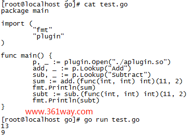

## lecture-1 mapreduce

`中间输出（intermediate output）`	每个Map函数输出的key-value对

`Job`	整个MapReduce计算称为Job。

`Task`	每一次MapReduce调用称为Task。

`Map函数(key, value)`	使用一个key和一个value作为参数,入参中，**key是输入文件的名字**，通常会被忽略，因为我们不太关心文件名是什么，**value是输入文件的内容**。对于一个单词计数器来说，value包含了要统计的文本，我们会将这个文本拆分成单词。之后对于每一个单词，我们都会调用emit

`emit(key, value)`	由MapReduce框架提供，并且这里的emit属于Map函数。emit会接收两个参数，其中一个是key，另一个是value。在单词计数器的例子中，emit入参的key是单词，value是字符串“1”


`Reduce函数(key, value)` 	入参是某个特定key的所有实例（Map输出中的key-value对中，出现了一次特定的key就可以算作一个实例。value是一个数组，里面每一个元素是Map函数输出的key的一个实例的value。对于单词计数器来说，key就是单词，value就是由字符串“1”组成的数组!

`emit函数(value)` 	这里的emit函数只会接受一个参数value，这个value会作为Reduce函数入参的key的最终输出。所以，对于单词计数器，我们会给emit传入数组的长度


`worker服务器` 	 	用来运行MapReduce的服务器集群

`Master节点`		来组织整个计算过程,Master服务器知道有多少输入文件，之后它将Map函数分发到不同的worker

**Map函数中调用emit的效果**:   是在worker的本地磁盘上创建文件，这些文件包含了当前worker的Map函数生成的所有的key和value

**运行Reduce函数之前**。运行在MapReduce的worker服务器上的进程需要与集群中每一个其他服务器交互来询问说，看，我需要对key=a运行Reduce，请看一下你本地磁盘中存储的Map函数的中间输出，找出所有key=a，并通过网络将它们发给我。所以，Reduce worker需要从每一个worker获取特定key的实例。这是通过由Master通知到Reduce worker的一条指令来触发

**一旦worker收集完所有的数据，它会调用Reduce函数**，Reduce函数运算完了会调用自己的emit，这个emit与Map函数中的emit不一样，它会将输出写入到一个Google使用的共享文件服务中。

**输入和输出文件的存放位置**:	因为我们想要灵活的在任意的worker上读取任意的数据,  所以我们需要某种网络文件系统（network file system）来存放输入数据

`GFS（Google File System）` 	GFS是一个共享文件服务，并且它也运行在MapReduce的worker集群的物理服务器上。GFS会自动拆分你存储的任何大文件，并且以64MB的块分摊存储在多个服务器之上。

`洗牌（shuffle）` 	将最开始在运行Map Task的机器上按照**行存储**的数据，而在运行Reduce函数的机器上转换为按照**列存储**

### `lab 1`

```g
src/main/mrsequential.go
mrapps/wc.go
mrapps/indexer.go
```


#### **go build命令**

###### **go build 无参数编译**

```go

//工程目录
.
└── src
    └── chapter11
        └── gobuild
            ├── lib.go
            └── main.go
//main.go
package main
import (
    "fmt"
)
func main() {
    // 同包的函数
    pkgFunc()
    fmt.Println("hello world")
}

lib.go
package main
import "fmt"
func pkgFunc() {
    fmt.Println("call pkgFunc")
}

//如果源码中没有依赖 GOPATH 的包引用，那么这些源码可以使用无参数 go build。格式如下：
go build

//在代码所在目录（./src/chapter11/gobuild）下使用 go build 命令，如下所示：
$ cd src/chapter11/gobuild/
$ go build
$ ls
gobuild  lib.go  main.go
$ ./gobuild
call pkgFunc
hello world
```

###### go build+需要编译的文件（同目录）

此方法文件列表中的每个文件必须是**同一个包**的 Go 源码，编译复杂工程时需要用“指定包编译”的方式。

```go
go build file1.go file2.go……
//在代码代码所在目录（./src/chapter11/gobuild）中使用 go build，在 go build 后添加要编译的源码文件名，代码如下：
$ go build main.go lib.go
$ ls
lib.go  main  main.go
$ ./main
call pkgFunc
hello world
$ go build lib.go main.go
$ ls
lib  lib.go  main  main.go
//如果需要指定输出可执行文件名，可以使用-o参数
$ go build -o myexec main.go lib.go
$ ls
lib.go  main.go  myexec
$ ./myexec
call pkgFunc
hello world
```

go build+包

```go
//相对于GOPATH的目录关系
.
└── src
    └── chapter11
        └──goinstall
            ├── main.go
            └── mypkg
                └── mypkg.go
//main.go
package main
import (
    "chapter11/goinstall/mypkg"
    "fmt"
)
func main() {
    mypkg.CustomPkgFunc()
    fmt.Println("hello world")
}
//mypkg.go
package mypkg
import "fmt"
func CustomPkgFunc() {
    fmt.Println("call CustomPkgFunc")
}
//按包方式编译 goinstall 代码
$ export GOPATH=/home/davy/golangbook/code
$ go build -o main chapter11/goinstall
$ ./goinstall
call CustomPkgFunc
hello world

//第 1 行，设置环境变量 GOPATH，这里的路径是笔者的目录，可以根据实际目录来设置 GOPATH。
//第 2 行，-o执行指定输出文件为 main，后面接要编译的包名。包名是相对于 GOPATH 下的 src 目录开始的。
//第 3～5 行，编译成功，执行 main 后获得期望的输出。
```

###### 附加参数

| 附加参数 | 备  注                                      |
| -------- | ------------------------------------------- |
| -v       | 编译时显示包名                              |
| -p n     | 开启并发编译，默认情况下该值为 CPU 逻辑核数 |
| -a       | 强制重新构建                                |
| -n       | 打印编译时会用到的所有命令，但不真正执行    |
| -x       | 打印编译时会用到的所有命令                  |
| -race    | 开启竞态检测                                |


#### go builmode

go help buildmode

```shell
        -buildmode=archive
                Build the listed non-main packages into .a files. Packages named
                main are ignored.

        -buildmode=c-archive
                Build the listed main package, plus all packages it imports,
                into a C archive file. The only callable symbols will be those
                functions exported using a cgo //export comment. Requires
                exactly one main package to be listed.

        -buildmode=c-shared
                Build the listed main package, plus all packages it imports,
                into a C shared library. The only callable symbols will
                be those functions exported using a cgo //export comment.
                Requires exactly one main package to be listed.

        -buildmode=default
                Listed main packages are built into executables and listed
                non-main packages are built into .a files (the default
                behavior).

        -buildmode=shared
                Combine all the listed non-main packages into a single shared
                library that will be used when building with the -linkshared
                option. Packages named main are ignored.

        -buildmode=exe
                Build the listed main packages and everything they import into
                executables. Packages not named main are ignored.

        -buildmode=pie
                Build the listed main packages and everything they import into
                position independent executables (PIE). Packages not named
                main are ignored.

        -buildmode=plugin
                Build the listed main packages, plus all packages that they
                import, into a Go plugin. Packages not named main are ignored.

```

###### **plugin**

https://mojotv.cn/go/golang-plugin-tutorial

1、创建插件 

创建一个插件方法aplugin.go:

```cpp
package main
func Add(x, y int) int {
    return x+y
}
func Subtract(x, y int) int {
    return x-y
}
```

构建插件aplugin.so

```cpp
go build -buildmode=plugin -o aplugin.so aplugin.go
```

2、插件调用 



#### WSL

Ubuntu20.04 **访问 Windows 下的文件**

WSL 可以访问 Windows 文件系统中的文件，WSL 根目录 **/mnt** 目录下有 **c**、**d** 等文件夹，分别表示本地的**C盘**、**D盘** ，直接使用 **cd** 命令，即可访问。

`sudo apt update`在安装软件包之前运行

## lecture-3 gfs

#### Master节点

`file表单`

`Chunk表单`

### `lab 2`

#### part A

Done

#### part B

选举时的限制：

1. the RPC includes information about the candidate’s log, and the
   voter **denies** its vote if its own log is **more up-to-date** than
   that of the candidate. 
   **up-to date**:   If the logs have last entries with different terms, then the log with the later term is more up-to-date. If the logs
   end with the same term, then whichever log is longer is
   more up-to-date.
   
   
   
2.  **Leader** : 
   when the leader gets a new command, it places it in its own log and then replicates it to followers. Followers place the command in their logs and acknowledge it to the leader, which keeps count of the latest log index that was safely replicated to a majority of servers in the cluster.

   **Replicating log entries**  (**rules in** Figure 2 in the "Rules for Servers" section) (**invovle method** : heartBeatTicker())

   ```go
   go func(peerId int) {
   
         cm.mu.Unlock()
         cm.dlog("sending AppendEntries to %v: ni=%d, args=%+v", peerId, ni, args)
         var reply AppendEntriesReply
   
   
             if reply.Success {
               cm.nextIndex[peerId] = ni + len(entries)
               cm.matchIndex[peerId] = cm.nextIndex[peerId] - 1
               cm.dlog("AppendEntries reply from %d success: nextIndex := %v, matchIndex := %v", peerId, cm.nextIndex, cm.matchIndex)
   
               savedCommitIndex := cm.commitIndex
               for i := cm.commitIndex + 1; i < len(cm.log); i++ {
                 if cm.log[i].Term == cm.currentTerm {
                   matchCount := 1
                   for _, peerId := range cm.peerIds {
                     if cm.matchIndex[peerId] >= i {
                       matchCount++
                     }
                   }
                   if matchCount*2 > len(cm.peerIds)+1 {
                     cm.commitIndex = i
                   }
                 }
               }
               if cm.commitIndex != savedCommitIndex {
                 cm.dlog("leader sets commitIndex := %d", cm.commitIndex)
                 cm.newCommitReadyChan <- struct{}{}
               }
             } else {
               cm.nextIndex[peerId] = ni - 1
               cm.dlog("AppendEntries reply from %d !success: nextIndex := %d", peerId, ni-1)
             }
   
       }(peerId)
   ```

   

#### part C

#### part D

